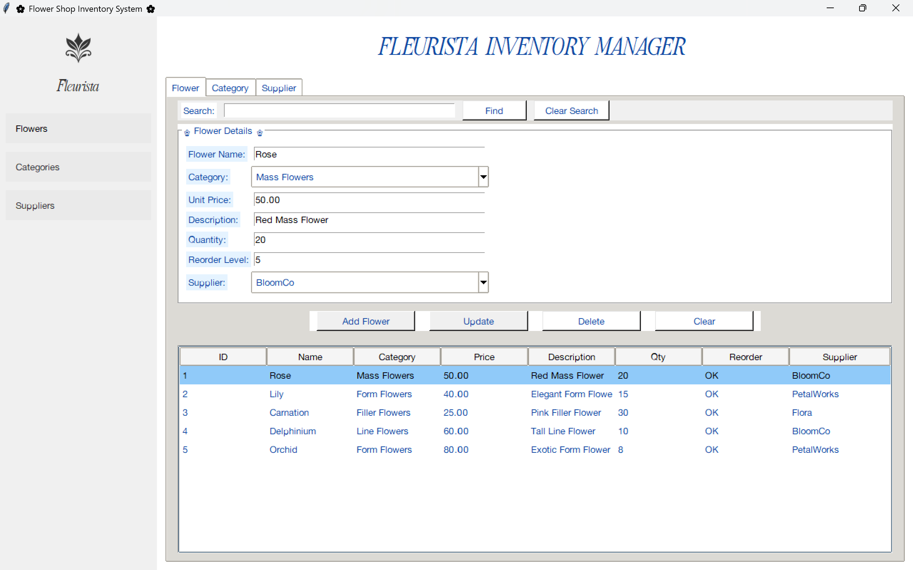

# 🌸 **Flower Shop Inventory System** 🌸

### *Fleurista Inventory Manager*

by **Claire Nicole V. Bay**
📅 *December 12, 2025*

---

```
                                                   
 ▄▄▄▄▄▄▄ ▄▄                                        
███▀▀▀▀▀ ██                   ▀▀         ██        
███▄▄    ██ ▄█▀█▄ ██ ██ ████▄ ██  ▄█▀▀▀ ▀██▀▀ ▀▀█▄ 
███▀▀    ██ ██▄█▀ ██ ██ ██ ▀▀ ██  ▀███▄  ██  ▄█▀██ 
███      ██ ▀█▄▄▄ ▀██▀█ ██    ██▄ ▄▄▄█▀  ██  ▀█▄██ 
```                                                   
                                                   

---

# 🌼 I. Project Objectives

This project aims to build a simple but powerful inventory system for a flower shop using **Python (Tkinter)** and **MySQL**.
Here’s what the system can do:

✨ **CRUD Operations** for

* 🌺 Flowers
* 🏷️ Categories
* 🚚 Suppliers

📦 **Inventory Management**

* Track stock levels automatically
* Alerts for **LOW STOCK**

🗂️ **Database Integration**

* Uses DAO Pattern for clean, organized data access

🔍 **Search Functionality**

* Quickly find flowers, categories, or suppliers

🖥️ **User-friendly GUI**

* Buttons, tables, validation, and intuitive navigation

---

# 🗃️ II. Database Schema (ERD)

Below is the exact schema described in your PDF.

### **Entities**

1. **Category**

   * category_id
   * name
   * description

2. **Supplier**

   * supplier_id
   * name
   * contact
   * address

3. **Flower**

   * flower_id
   * name
   * category_id (FK → Category)
   * unit_price
   * description
   * quantity
   * reorder_level
   * supplier_id (FK → Supplier)

### **Relationships**

* A **flower** belongs to **one category** (Many-to-One)
* A **flower** is supplied by **one supplier** (Many-to-One)

---
## 🌿 **ERD Diagram (MySQL Workbench)**


---

# 🖼️ III. GUI Screenshots


## 🌺 **Flower Tab**

Features:

* Full flower table
* Add / Update / Delete functionality
* Search bar
* Category & Supplier dropdowns
  


## 🏷️ **Category Tab**

Features:

* Category list
* CRUD operations


## 🚚 **Supplier Tab**

Features:

* Supplier list
* CRUD operations


# 💭 IV. Reflection and Conclusions

🧠 **Reflection:**
Working on this system taught me how to connect Python to MySQL using the **DAO Pattern**, which made the code more organized and easier to maintain. I also learned how to design GUIs using Tkinter, apply styles, validate inputs, and manage relationships between tables.

📌 **Conclusion:**
The Flower Shop Inventory System successfully handles all essentials:

* Clean inventory management
* Accurate stock monitoring (LOW / OK indicators)
* Organized data handling
* Functional user interface
* Strong Python–MySQL integration

It proves how Python + databases can create practical, real-world software.

---

# 📚 V. References

1. Python Tkinter Documentation
2. MySQL Reference Docs
3. DAO Pattern Tutorials (GeeksForGeeks)


---
